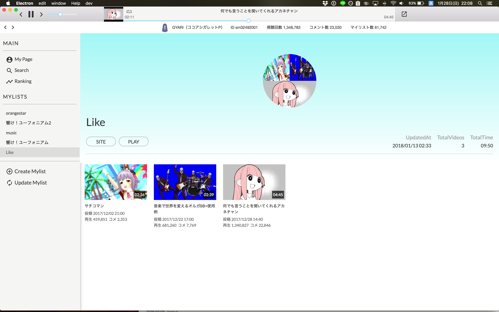
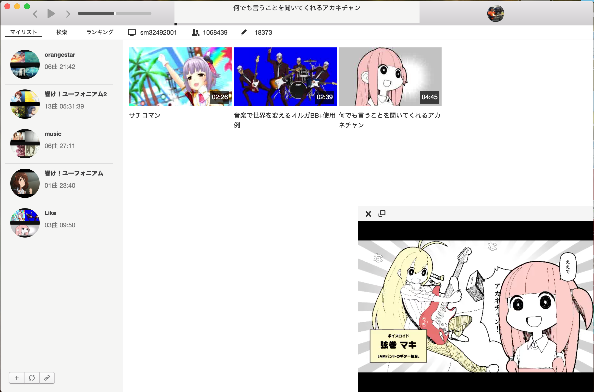
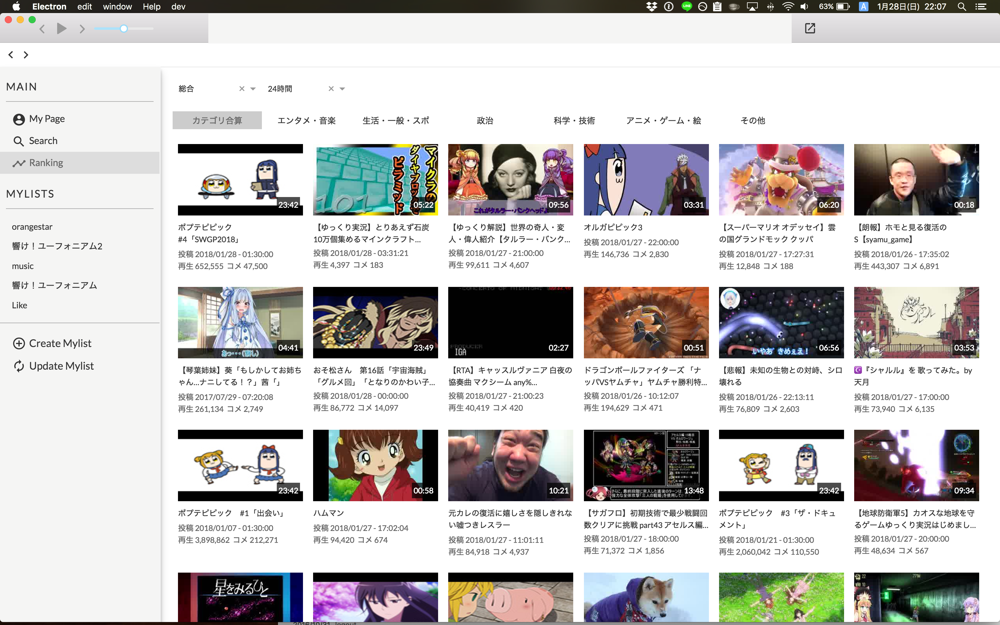

<div align="center">
  
</div>

今現在、バージョンはαです。

## NicoHacoとは？
[NicoBox](https://itunes.apple.com/jp/app/nicobox-%E3%83%8B%E3%82%B3%E3%83%9C%E3%83%83%E3%82%AF%E3%82%B9/id421753493?mt=8)のPC版アプリです。  
NicoBoxと同様に、ニコニコ動画を音楽として聞くことに特化しています。  
また、動画も再生することが可能です。

## スクリーンショット
### マイリスト


### 動画再生


### ランキング


[](https://travis-ci.org/abouthiroppy/nicohaco)

Slide: https://abouthiroppy.github.io/slides/nicohaco/


## ダウンロード
[こちら](https://github.com/abouthiroppy/nicohaco/releases)から最新のdmgをダウンロードし、インストーラーを使う。

## 検証プラットフォーム
- [ ] windows
- [x] osx
- [ ] linux

## 配布パッケージ
- [ ] windows
- [x] osx
- [ ] linux

## 機能
- 音楽、動画どちらの再生も可能
- 音楽の場合は、ループ、連続再生が可能
- ランキング
- 検索
- マイリストの作成、追加、削除

## Assets
[mi77jp/nicohaco-logo](https://github.com/mi77jp/nicohaco-logo)  

## Changelog
[CHANGELOG.md](https://github.com/abouthiroppy/nicohaco/blob/master/CHANGELOG.md)

## リリースログ
[リリースリスト](https://github.com/abouthiroppy/nicohaco/releases)

## 要望、バグ報告
[Issues](https://github.com/abouthiroppy/nicocako/issues)の方へ起票してください。
## PR, ISSUEについて
日本語でも英語でも可能です。

## スペシャルサンクス
Icon: [@mi77](https://github.com/mi77jp)  
デバッグに協力してくださった皆さん

## 開発
```shell
$ yarn install
$ yarn start # terminal 1
$ yarn electron # terminal 2
```
