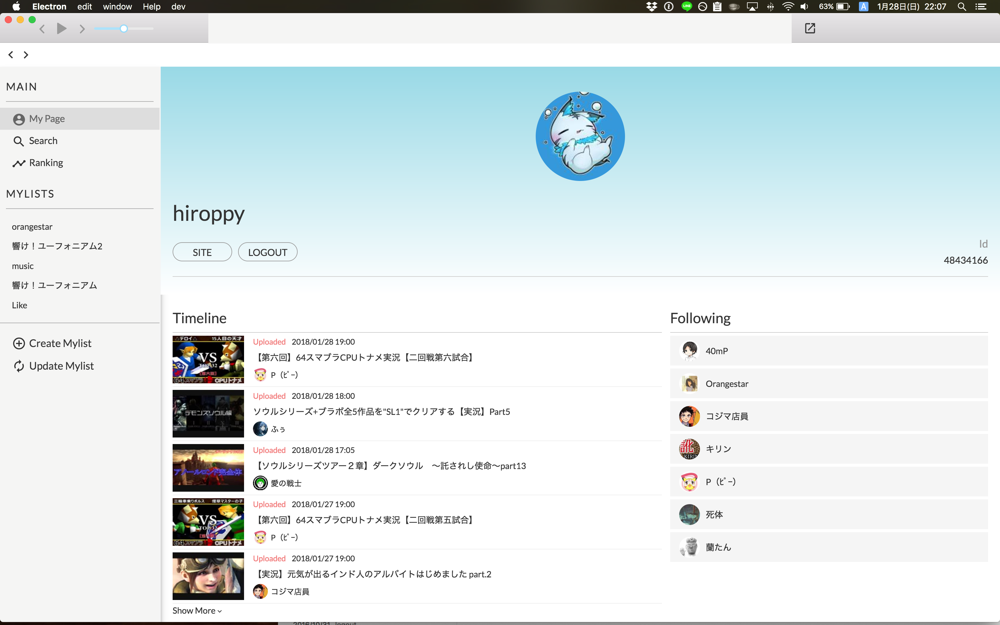
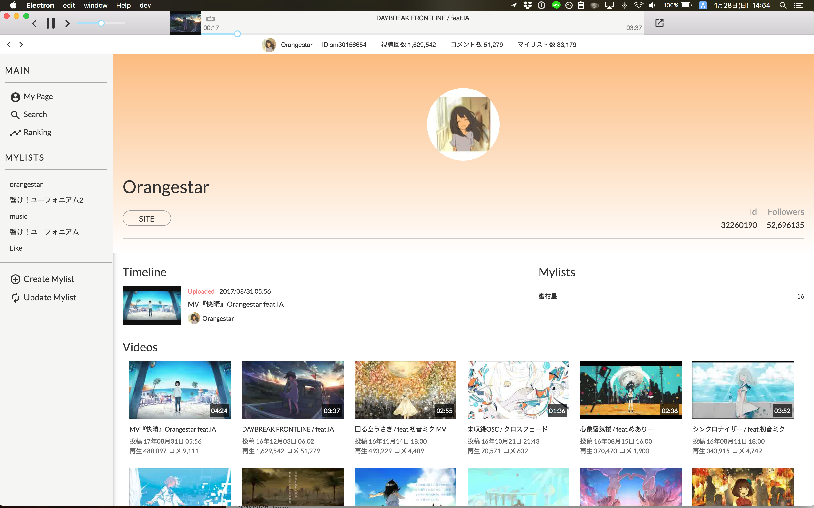
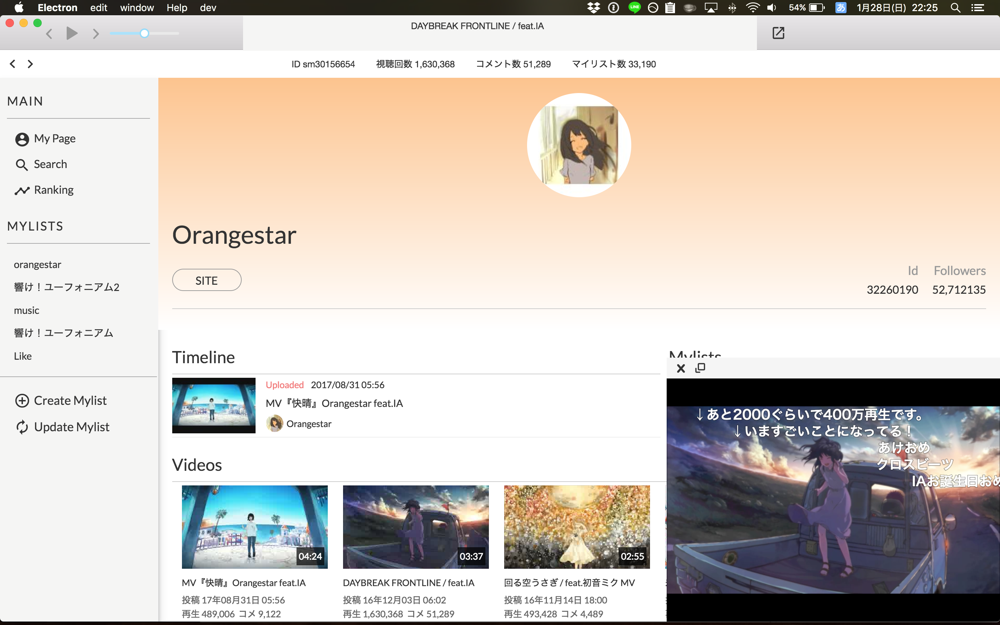

<div align="center">
  
</div>

[](https://travis-ci.org/abouthiroppy/nicohaco)

今現在、バージョンはβです。

## 問い合わせ
[@about_hiroppy](https://twitter.com/about_hiroppy)の方に連絡をするか、[Issues](https://github.com/abouthiroppy/nicocako/issues)の方へ起票してください。

## 配布パッケージ
[リリースリスト](https://github.com/abouthiroppy/nicohaco/releases)から合うOSのパッケージを落としてください。

### 検証プラットフォーム
- [ ] windows
- [x] osx
- [ ] linux

### 配布パッケージ
- [x] windows
- [x] osx
- [ ] linux

## NicoHacoとは？
[NicoBox](https://itunes.apple.com/jp/app/nicobox-%E3%83%8B%E3%82%B3%E3%83%9C%E3%83%83%E3%82%AF%E3%82%B9/id421753493?mt=8)のPC版アプリです。  
NicoBoxと同様に、ニコニコ動画を音楽として聞くことに特化しています。  
また、動画も再生することが可能です。

## 機能
- 音楽を再生が可能
  - 1曲、プレイリスト内のループも可能
- 動画の再生可能
  - 動画も再生が可能だが、外部プレイヤーを使っているためコメントが打てない
- 最前面に動画プレイヤーを置くことが可能
- マイリストの操作(追加、削除)
- ランキングの閲覧が可能
- ニコレポの閲覧が可能
- 動画検索が可能
- etc...

## ページ
- マイページ (`/users/me`)
- ランキング (`/ranking`)
- 検索 (`/search`)
- 個人ページ (`/users/:id`)
- マイリスト (`/mylists/:id`)

## スクリーンショット
### マイページ
タイムライン(ニコレポ)を閲覧することが可能です。



### ユーザーページ
タイムラインとユーザーの公開されているマイリスト・投稿動画を閲覧することが可能です。



### マイリスト
自分のマイリストのみローカルのストレージに保存しています。


### 動画再生
動画プレイヤーの再生は3パターン存在します。
- 全画面
- 小さい画面
- 常に画面の最前面にいる別画面

以下のスクリーンショットは小さい画面の時です。



もし、最前面にプレイヤーを別Windowとして出したい場合はヘッダーにある以下のボタンをおしてください。


### ランキング


## Assets
[mi77jp/nicohaco-logo](https://github.com/mi77jp/nicohaco-logo)  

## Changelog
[CHANGELOG.md](https://github.com/abouthiroppy/nicohaco/blob/master/CHANGELOG.md)

## スペシャルサンクス
Icon: [@mi77](https://github.com/mi77jp)  
デバッグに協力してくださった皆さん

## 開発
```shell
$ npm install
$ npm start # terminal 1
$ npm run electron # terminal 2
```
